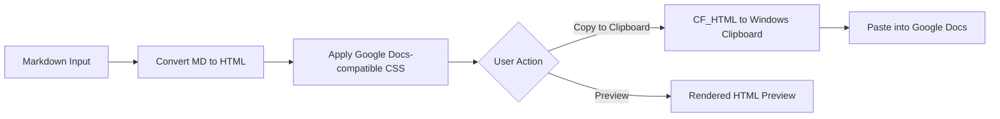

# Markdown to Google Docs Converter - Plan

## Overview

A local web application that converts Markdown text into Google Docs-compatible rich HTML, with the ability to copy the formatted output to the clipboard for direct pasting into Google Docs.

## Architecture

### Technology Stack
- **Backend**: Python 3 + Flask
- **Frontend**: HTML/CSS/JavaScript (served by Flask)
- **Markdown Parsing**: `markdown2` library with extras
- **Clipboard**: `pywin32` (win32clipboard) for Windows CF_HTML rich text clipboard
- **Live Preview**: Client-side markdown rendering for instant feedback

### Conversion Flow



### Why Rich HTML Clipboard?

Google Docs accepts **CF_HTML** clipboard format on Windows. When you copy formatted HTML and paste into Google Docs, it preserves:
- Headings (H1-H6 mapped to Google Docs heading styles)
- Bold, italic, strikethrough
- Ordered and unordered lists
- Tables with borders
- Code blocks with monospace font
- Links
- Blockquotes

Plain text clipboard (like pyperclip) would lose all formatting.

## Project Structure

```
MD Conversion/
├── app.py                  # Flask application entry point
├── requirements.txt        # Python dependencies
├── README.md               # Setup and usage documentation
├── converter/
│   ├── __init__.py
│   ├── md_to_html.py       # Markdown-to-HTML conversion with GDocs styling
│   └── clipboard.py        # Windows CF_HTML clipboard handler
├── templates/
│   └── index.html          # Main UI template (Jinja2)
├── static/
│   ├── css/
│   │   └── style.css       # Application styles
│   └── js/
│       └── app.js          # Frontend logic
└── plans/
    └── plan.md             # This plan file
```

## Detailed Component Design

### 1. Markdown-to-HTML Converter (`converter/md_to_html.py`)

**Responsibilities:**
- Parse markdown using `markdown2` with these extras:
  - `fenced-code-blocks` - for ``` code blocks
  - `tables` - for pipe tables
  - `task_list` - for checkbox lists
  - `strike` - for ~~strikethrough~~
  - `header-ids` - for heading anchors
  - `cuddled-lists` - for lists without blank line before them
  - `break-on-newline` - to handle single newlines
- Wrap output HTML with Google Docs-compatible inline styles
- Apply a post-processing step to inject inline CSS since Google Docs ignores `<style>` tags and class-based CSS

**Google Docs Styling Rules:**
- Headings: Use inline `font-size` and `font-weight` (H1=24pt, H2=20pt, H3=16pt, etc.)
- Code blocks: `font-family: monospace; background-color: #f5f5f5; padding: 8px;`
- Tables: `border: 1px solid #000; border-collapse: collapse;` on cells
- Blockquotes: `border-left: 3px solid #ccc; padding-left: 12px; color: #666;`
- Links: Preserve `<a href>` tags - Google Docs handles them

### 2. Windows Clipboard Handler (`converter/clipboard.py`)

**Responsibilities:**
- Register/use the CF_HTML clipboard format on Windows
- Format HTML using the CF_HTML header specification:
  ```
  Version:0.9
  StartHTML:XXXXX
  EndHTML:XXXXX
  StartFragment:XXXXX
  EndFragment:XXXXX
  ```
- Open clipboard, empty it, set both CF_HTML and CF_UNICODETEXT (fallback), close clipboard
- Handle errors gracefully (clipboard locked by another app, etc.)

### 3. Flask Backend (`app.py`)

**Endpoints:**
- `GET /` - Serve the main UI page
- `POST /api/convert` - Accept markdown text, return converted HTML
  - Request: `{ "markdown": "# Hello World" }`
  - Response: `{ "html": "<h1>Hello World</h1>" }`
- `POST /api/clipboard` - Accept markdown, convert to HTML, copy to clipboard
  - Request: `{ "markdown": "# Hello World" }`
  - Response: `{ "success": true, "message": "Copied to clipboard" }`

### 4. Web UI (`templates/index.html`, `static/js/app.js`, `static/css/style.css`)

**Layout:**
- Split-pane design: markdown editor on left, live HTML preview on right
- Toolbar at top with:
  - "Copy to Clipboard" button (primary action)
  - "Clear" button
  - File upload button (drag-and-drop .md files)
- Status bar at bottom showing conversion status

**Frontend Behavior:**
- Live preview updates as you type (debounced, ~300ms delay)
- Client-side markdown preview using `marked.js` for instant feedback
- Server-side conversion triggered on "Copy to Clipboard" (for accurate Google Docs formatting)
- Visual feedback when content is copied (toast notification)
- Textarea supports tab key for indentation

## Dependencies (`requirements.txt`)

```
flask>=3.0
markdown2>=2.4
pywin32>=306
```

## Step-by-Step Implementation Plan

1. **Set up project structure** - Create all directories and `requirements.txt`
2. **Build converter module** - `md_to_html.py` with markdown parsing and inline CSS injection
3. **Build clipboard module** - `clipboard.py` with CF_HTML Windows clipboard support
4. **Create Flask backend** - `app.py` with all API endpoints
5. **Build web UI** - HTML template with split-pane layout
6. **Create frontend JS** - Live preview, clipboard API calls, file upload
7. **Style the application** - Clean, modern CSS
8. **Test end-to-end** - Verify pasting into Google Docs preserves formatting
9. **Write README** - Setup instructions and usage guide

## Future Enhancements (Phase 2)

- Google Docs API integration to create documents directly
- Save/load markdown files
- Multiple themes/styling presets
- Export to other formats (DOCX, PDF)
- Markdown syntax toolbar (bold, italic, heading buttons)
